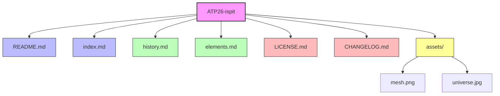

# :mortar_board: ATP26 Ispit

> [!NOTE]
> Ovaj projekt je izrađen kao dio kolegija ATP26. Sadrži sveobuhvatnu dokumentaciju o User Experience Design-u preuzetu s Wikipedije i drugih izvora.


## :books: Sadržaj

- :house: [Početna stranica](index.md)
- :clock3: [History](history.md)
- :jigsaw: [Elements](elements.md)
  - Research
  - Visual Design
  - Information Architecture
  - Interaction Design
  - Usability
  - Accessibility
    - WCAG Compliance
  - Human-Computer Interaction
    - Getting Ready to Design
    - Design
    - User Research

---

## :page_facing_up: Dokumentacija projekta

- :scroll: [LICENSE.md](LICENSE.md) - MIT Licenca
- :memo: [CHANGELOG.md](CHANGELOG.md) - Povijest promjena

> [!TIP]
> Za brzi početak, pogledajte [index.md](index.md) koji služi kao početna stranica GitHub Pages-a.

---

## :computer: Primjer koda

Primjer JavaScript funkcije za praćenje korisničkog iskustva:

```javascript
// UX Event Tracker - GitHub Gist Example
// https://gist.github.com/

class UXTracker {
  constructor(userId) {
    this.userId = userId;
    this.events = [];
    this.sessionStart = Date.now();
  }

  trackEvent(eventName, metadata = {}) {
    const event = {
      name: eventName,
      timestamp: Date.now(),
      metadata: metadata
    };
    this.events.push(event);
    console.log(`Event tracked: ${eventName}`);
  }

  getSessionDuration() {
    return Date.now() - this.sessionStart;
  }
}

// Primjer korištenja
const tracker = new UXTracker('user123');
tracker.trackEvent('page_view', { page: '/home' });
tracker.trackEvent('button_click', { button: 'signup' });
```

---

## :framed_picture: Galerija


*Slika: Vizualizacija kompleksnosti korisničkog iskustva*

---

## :link: Izvori i reference

> [!WARNING]
> Sav sadržaj preuzet je iz navedenih izvora samo u edukativne svrhe. Molimo poštujte autorska prava.

### :newspaper: Tekstualni izvori:
- [Wikipedia - User Experience Design](https://en.wikipedia.org/wiki/User_experience_design)
- [Nielsen Norman Group](https://www.nngroup.com/articles/definition-user-experience/)
- [Interaction Design Foundation](https://www.interaction-design.org/)

### :camera: Izvori slika:
- `mesh.png` - Lokalna datoteka iz assets foldera
- `universe.jpg` - Lokalna datoteka iz assets foldera

### :books: Dodatna literatura:
- Norman, Donald (2013). *The Design of Everyday Things*
- Cooper, Alan (2014). *About Face: The Essentials of Interaction Design*

---

## :film_projector: Video o UX dizajnu

[](https://www.youtube.com/watch?v=ziQEqGZB8GE)

*Kliknite na sliku za gledanje videa o UX dizajnu na YouTube-u*

---

## :file_folder: Struktura repozitorija



---
---

> [!IMPORTANT]
> Ovaj projekt koristi GitHub Flavored Markdown. Za najbolje iskustvo, pregledajte dokumentaciju na GitHubu.

---

**Navigacija:** :arrow_left: [Početna](index.md) | :clock3: [History →](history.md) | :jigsaw: [Elements →](elements.md)

*Zadnje ažurirano: 22. siječnja 2026.*